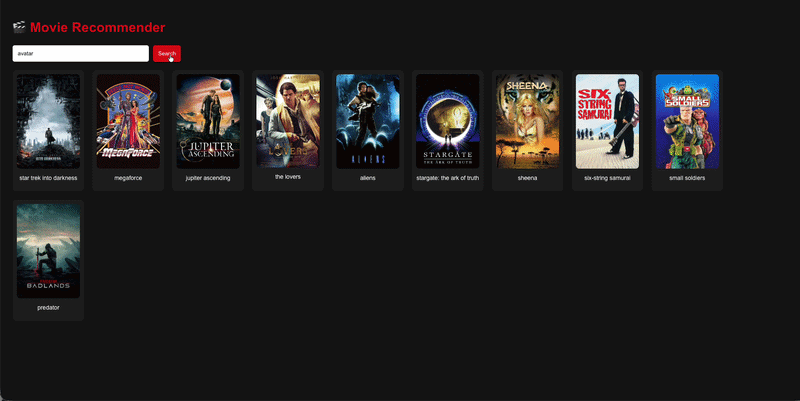

# 🎬 Movie Recommender Full-Stack ML App

A modern full-stack machine learning web application that recommends movies based on similarity and user search input. Built with **FastAPI (backend)**, **React (frontend)**, and **Scikit-learn (ML model)**.

---

## 🚀 Live Demo
> 



---

## 🧠 Project Overview

This project is a **content-based movie recommendation system** that:

- Suggests movies similar to the selected title
- Provides real-time search autocomplete suggestions
- Fetches movie posters from TMDB API
- Uses cosine similarity for recommendations

---

## 🏗️ Architecture

```
Frontend (React)
      |
      | HTTP Requests
      v
Backend (FastAPI)
      |
      | Loads ML Model
      v
Scikit-learn (Cosine Similarity)
      |
      v
Movie Dataset + TMDB API
```

---

## ⚙️ Tech Stack

### Frontend
- React.js
- JavaScript (ES6)
- Fetch API
- CSS (Inline Styling)

### Backend
- FastAPI
- Python
- Scikit-learn
- Pandas
- Pickle

### Machine Learning
- CountVectorizer / TF-IDF
- Cosine Similarity
- Content-based filtering

---

## 📂 Project Structure

```
Movie Recommendation/
│
├── backend/
│   ├── main.py
│   ├── movie_recommendation.ipynb
│   ├── tmdb_5000_movies.csv
│   ├── tmdb_5000_credits.csv
│
├── frontend/
│   ├── src/
│   │   ├── App.js
│   │   └── index.js
│
├── model.pkl (ignored)
├── movies.pkl (ignored)
├── .gitignore
└── README.md
```

---

## 🔥 Features

- 🔎 Real-time movie search suggestions
- 🎬 Top 10 movie recommendations
- 🖼️ Movie poster integration (TMDB API)
- ⚡ Fast API backend (FastAPI)
- 🧠 ML-powered recommendation engine
- 🌐 Full-stack integration

---

## 🧪 API Endpoints

### 1. Search Movies
```
GET /search?query=batman
```

### 2. Get Recommendations
```
GET /recommend?movie=inception
```

### 3. Health Check
```
GET /
```

---

## 🧠 ML Model Details

- Dataset: TMDB 5000 Movies Dataset
- Feature Engineering: tags (genres + overview + cast + crew)
- Vectorization: CountVectorizer
- Similarity: Cosine Similarity Matrix

---

## 🔐 Environment Variables

Create a `.env` file:

```
TMDB_API_KEY=your_api_key_here
```

⚠️ Never commit API keys to GitHub.

---

## 🚀 Run Locally

### Backend
```
cd backend
pip install -r requirements.txt
uvicorn main:app --reload
```

### Frontend
```
cd frontend
npm install
npm start
```

---

## 🧹 Git Ignore

Make sure these are excluded:

```
.env
venv/
model.pkl
movies.pkl
node_modules/
```

---

## 📈 Future Improvements

- Deploy on Vercel + Render
- Add login system
- Add collaborative filtering
- Improve UI with Tailwind CSS
- Add movie trailers (YouTube API)

---

## 👨‍💻 Author

Built by Jake Lee 🚀

---

## ⭐ If you like this project

Give it a star ⭐ and feel free to fork it!

